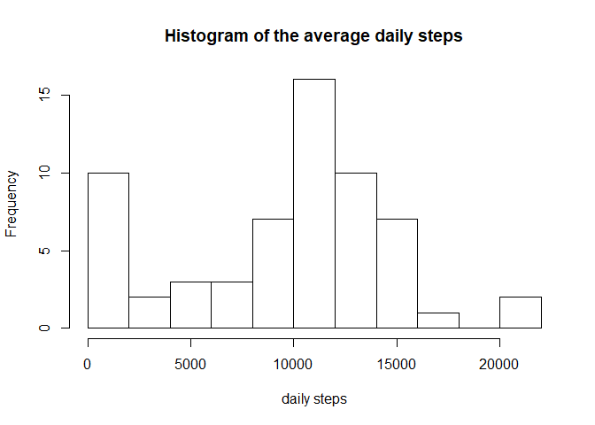
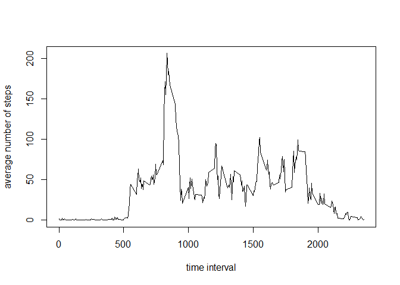
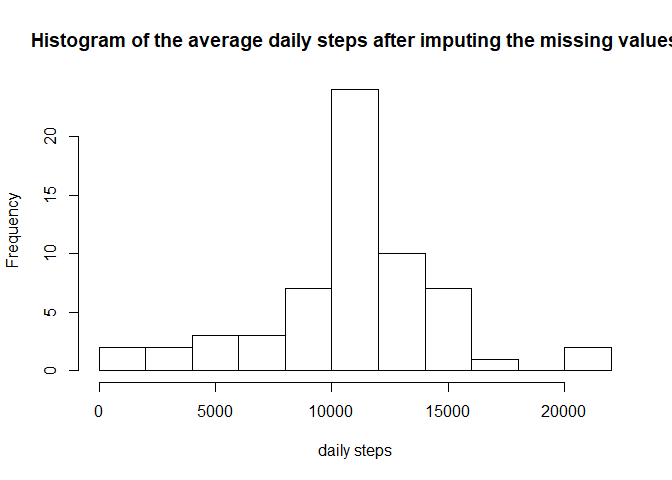
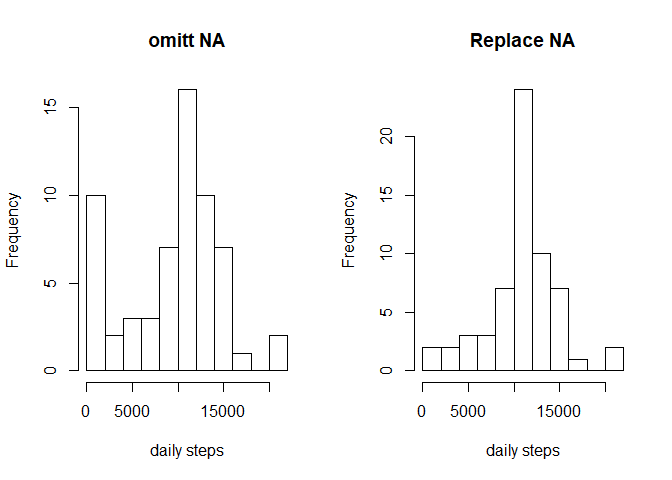
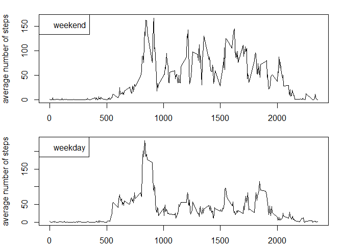

## Loading and preprocessing the data


```r
options(scipen=999)
library(dplyr)
data <- read.csv(file = "activity.csv", header = TRUE)
```


## What is mean total number of steps taken per day?

```r
dailysteps <- data %>% group_by(date) %>% summarise(sum(steps, na.rm = TRUE))
names(dailysteps) = c("date", "daily.steps")
hist(dailysteps$daily.steps, breaks = 15, xlab = "daily steps", main = "Histogram of the average daily steps")
```

<!-- -->


```r
average <- round(mean(dailysteps$daily.steps), digits = 0)
average
```

```
## [1] 9354
```
The mean total number of steps taken per day is 9354


```r
median <- median(dailysteps$daily.steps)
median
```

```
## [1] 10395
```
The mean total number of steps taken per day is 10395

## What is the average daily activity pattern?

```r
intervallsteps <- data %>% group_by(interval) %>% summarise(mean(steps, na.rm = TRUE))
names(intervallsteps) = c("interval", "av.daily.steps")
plot(intervallsteps$interval, intervallsteps$av.daily.steps, type = "l", xlab = "time interval", ylab = "average number of steps")
```

<!-- -->


```r
maxtime <- intervallsteps[which.max(intervallsteps$av.daily.steps), 1]
maxtime
```

```
## # A tibble: 1 x 1
##   interval
##      <int>
## 1      835
```
The intervall at 835 has the maximum average daily steps

## Imputing missing values
We're going to fill the missing values with the mean of the correspondent interval


```r
newdata <- mutate(data, missing.data = (is.na(steps)| is.na(date)))
newdata <- full_join(newdata, intervallsteps, by = "interval")
newdata[is.na(newdata)] <- 0
newdata <- mutate(newdata, new.steps = steps + (missing.data * av.daily.steps))
newdata <- select(newdata, date, interval, new.steps)

newdailysteps <- newdata %>% group_by(date) %>% summarise(sum(new.steps, na.rm = TRUE))
names(newdailysteps) = c("date", "daily.steps")
hist(newdailysteps$daily.steps, breaks = 15, xlab = "daily steps", main = "Histogram of the average daily steps after imputing the missing values")
```

<!-- -->

We can compare the 2 histograms


```r
par(mfrow=c(1,2))
hist(dailysteps$daily.steps, breaks = 15, xlab = "daily steps", main = "omitt NA")
hist(newdailysteps$daily.steps, breaks = 15, xlab = "daily steps", main = "Replace NA")
```

<!-- -->

As for the numerical values:

```r
newaverage <- round(mean(newdailysteps$daily.steps), digits = 0)
newaverage
```

```
## [1] 10766
```


```r
newmedian <- median(newdailysteps$daily.steps)
newmedian
```

```
## [1] 10766.19
```


```r
avdiff <- newaverage - average
meandiff <- newmedian - median
```
The new average is 10766 which differs by 1412 to before    
The new median is 10766.1886792 which differs by 371.1886792 to before  

As we can see the mean differs quite a lot the median in this example not at all. This is because the median is much more robust than the mean. But in general one has to be careful when replacing NA-Values, because it can change the data a lot.


## Are there differences in activity patterns between weekdays and weekends?

```r
newdata <- mutate(newdata, weekday = weekdays(as.Date(date, format = "%Y-%m-%d")))

weekends <- filter(newdata, weekday == "Saturday" | weekday =="Sunday")
noweekends <- filter(newdata, weekday =="Monday" | weekday == "Tuesday" | weekday=="Wednesday" | weekday == "Thursday" | weekday == "Friday")

intervallstepsweekend <- weekends %>% group_by(interval) %>% summarise(mean(new.steps))
names(intervallstepsweekend) = c("interval", "av.daily.steps")

intervallstepsweekday <- noweekends %>% group_by(interval) %>% summarise(mean(new.steps))
names(intervallstepsweekday) = c("interval", "av.daily.steps")
```

Now we can make a panel plot comparing the two timeseries:


```r
par(mfrow=c(2,1), mar = c(2,4,1.5,1.5))
plot(intervallstepsweekend$interval, intervallstepsweekend$av.daily.steps, type = "l", xlab = "time interval", ylab = "average number of steps")
legend("topleft", legend = "weekend")

plot(intervallstepsweekday$interval, intervallstepsweekday$av.daily.steps, type = "l", xlab = "time interval", ylab = "average number of steps", )
legend("topleft", legend = "weekday")
```

<!-- -->
